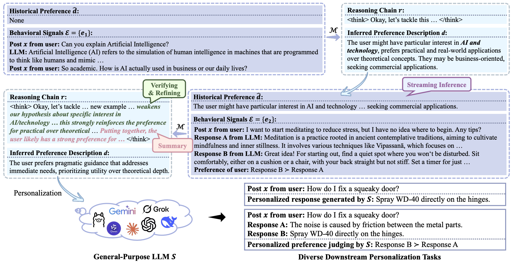
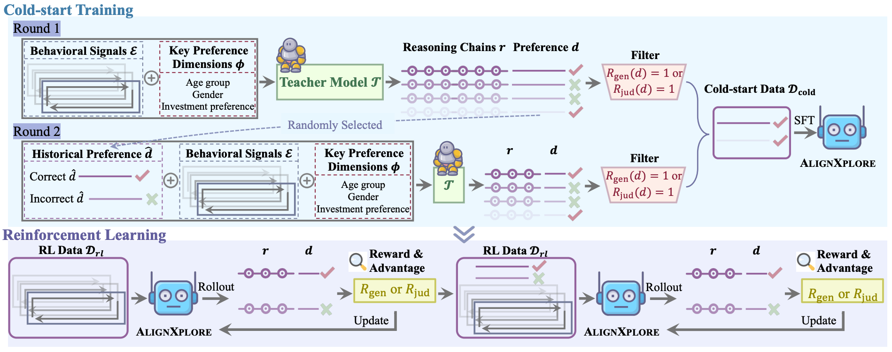

<div align="center">
  <h1 style="font-size: 40px;">AlignXplore</h1>
  <p>Extended Inductive Reasoning for Personalized Preference Inference from Behavioral Signals</p>

  [](https://arxiv.org/abs/2505.18071)
  [](https://huggingface.co/datasets/JinaLeejnl/AlignXplore)
  [](https://huggingface.co/JinaLeejnl/AlignXplore-7B-Streaming)

</div>

<strong>AlignXplore</strong> is a deep user understanding framework designed to infer rich and human-readable preference summaries from complex—even noisy—behavioral signals.
- <strong>Streaming</strong>: Built for streaming scenarios. As new signals arrive, AlignXplore incrementally updates existing preference summaries through lightweight reasoning—eliminating the need to rerun costly end-to-end inference from scratch.
- <strong>Flexible</strong>: Supports heterogeneous input formats out of the box, including preference pairs (e.g., post–chosen–rejected comparisons) and free-form text signals such as user-generated content.
- <strong>Robust</strong>: Delivers stable and reliable performance under noisy inputs and remains resilient to abrupt or long-term shifts in user preferences.

# Task Overview

Our model performs human-like inductive reasoning for preference inference by progressively refining its preference hypotheses through iterative testing and validation. These inferred preferences can then guide diverse downstream personalization tasks.

<p align="center">
  
</p>
<p align="center">
  <em>Figure: Preference inference task overview.</em>
</p>

# Training Process

AlignXplore combines cold-start training using synthetic data from teacher models with reinforcement learning optimization to enhance the model’s reasoning capabilities.

<p align="center">
  
</p>
<p align="center">
  <em>Figure: Two-stage training process of AlignXplore.</em>
</p>

# :rocket: Quick Start
## Requirements

To install requirements:

```setup
pip install -r requirements.txt
```

## Training

### Cold-start training

```train
cd cold-start training
./sft.sh # Set `data_path` to `cold_start.json` for the base setting, and `streaming_cold_start.json` for the streaming setting.
```

### Reinforcement learning

The code is developed based on [Open-Reasoner-Zero](https://github.com/Open-Reasoner-Zero/Open-Reasoner-Zero).

### Base setting

#### Train with $R_{jud}$

```train
cd reinforcement learning
./run_ppo_jud.sh # with `prompt_data` set to `rl_train.json`
```

#### Train with $R_{gen}$

Modify the file `/reinforcement learning/orz/ppo/actors.py`:
- Change line [1027](https://github.com/AntResearchNLP/AlignXplore/blob/9dcd5f3f04c68b460b02a66854d5e309f6705496/reinforcement%20learning/orz/ppo/actors.py#L1027) to `RewardRayActor = ray.remote(num_gpus=1)(genRewardRayActorBase)`.

```train
cd reinforcement learning
./run_ppo_gen.sh # with `prompt_data` set to `rl_train.json`
```

### Streaming setting

#### Train with $R_{jud}$

```train
cd reinforcement learning
./run_ppo_streaming.sh # with `prompt_data` set to `streaming_rl_train.json`
```

## Evaluation

### $ACC_{jud}$

1. `cd eval`
2. For the model you have trained, run `python train_gen_pref.py`; for the open-source models, run `python notrain_gen_pref.py`.
3. `python eval_preference.py`

<!--
# Links

- 📜 [Paper](https://arxiv.org/abs/2505.18071v2)
- 🤗 [Data](https://huggingface.co/datasets/JinaLeejnl/AlignXplore)
  - base setting: cold_start.json, rl_train.json
  - streaming setting: streaming_cold_start.json, streaming_rl_train.json
  - eval: rl_test.json
-->

# 📄 Citation
```
@misc{li2025extendedinductivereasoningpersonalized,
      title={Extended Inductive Reasoning for Personalized Preference Inference from Behavioral Signals}, 
      author={Jia-Nan Li and Jian Guan and Wei Wu and Rui Yan},
      year={2025},
      eprint={2505.18071},
      archivePrefix={arXiv},
      primaryClass={cs.CL},
      url={https://arxiv.org/abs/2505.18071}, 
}
```
